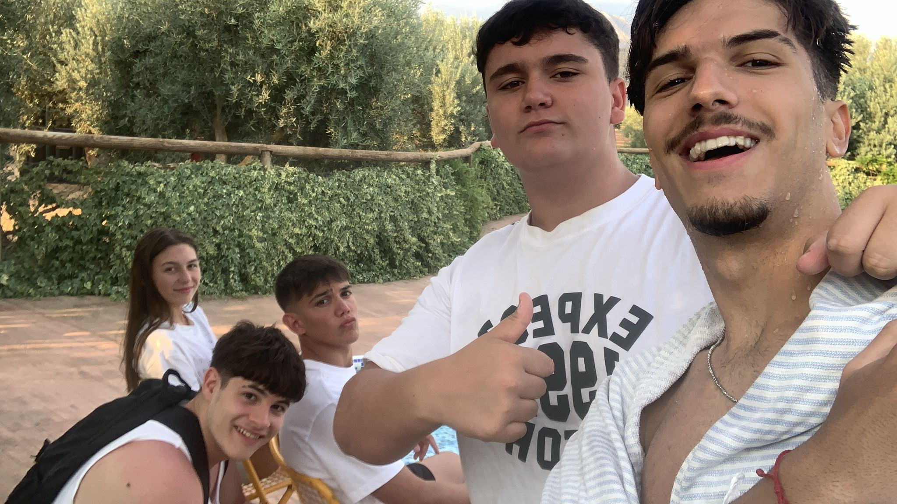

<!DOCTYPE html>
<html lang="es">
<head>
    <meta charset="UTF-8">
    <meta name="viewport" content="width=device-width, initial-scale=1.0">
    <title>Página Animada para Damián</title>
    
</head>
<body>
    <audio autoplay loop>
        <source src="ninos_maravilla.mp3" type="audio/mpeg">
    </audio>    
    

        <h1>¡Hola, Damián!</h1>
        
Damián Rodríguez (mi pené), mi hermano de otra sangre, desde pequeños nadie nos separaba y no parábamos de experimentar cosas nuevas y de reírnos de cosas absurdas como la mua o el colacao, solo con hacer el gesto nos leemos la mente, y otra cosa nos gusta estudiar lo mismo pero yo he tenido el error de meterme en esta mierda, pero tranquilo que ya llegaré yo para hacerlo todo broza, no hay nada más que decir que disfrutes de tus 17 con los que quieres. Un abrazo hermano. ❤❤

        <button class="button">¡Eres el mejor!</button>
        
